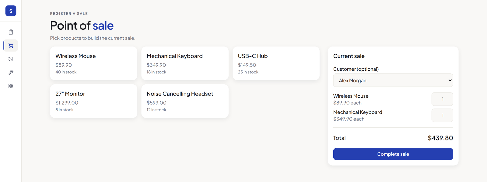
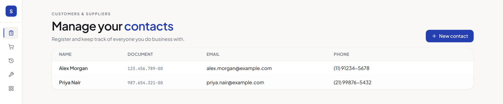
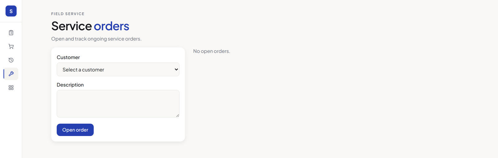

# Storefront Suite Web (Frontend Demo)

[](https://react.dev/)
[](https://www.typescriptlang.org/)
[](https://vite.dev/)
[](https://tailwindcss.com/)
[](https://vitest.dev/)


A fully working, front-end-only demo application built to showcase architecture, code
organization and UI engineering skills. It reproduces three common retail workflows
(**Contacts**, **Point of Sale (POS)** and **Service Orders**), with all data mocked in
memory and persisted to `localStorage`, so it runs standalone with **no backend required**.

This project is a portfolio piece: it is not connected to, and does not depend on, any
production system.

## Screens

**Point of Sale**, cart built from a mocked catalog, with stock validation and an optional customer.



**Contacts**, the customer and supplier registry.



**Service Orders**, each order moving through `open`, `in_progress`, `closed` or `cancelled`.



## Features

- **Contacts**: create, edit, list and delete customer records.
- **Point of Sale**: build a cart from a mocked product catalog, optionally attach a
  customer, and check out (with stock validation).
- **Sales History**: browse every completed sale and cancel one if needed.
- **Service Orders**: open an order for a customer, move it through `open → in_progress
  → closed/cancelled`.
- **Service Orders History**: browse closed/cancelled orders with their full status
  timeline.

## Architecture

The codebase favors clear boundaries and dependency inversion over shortcuts, so the
mocked data layer could be swapped for real HTTP calls without touching UI or business
logic:

```
src/
  domain/      entities and repository interfaces (the contracts)
  data/        mock repositories implementing those interfaces (in-memory + localStorage)
  services/    use-cases / business rules, depending only on domain interfaces
  hooks/       React Query hooks that expose services to the UI
  pages/       route-level screens
  components/  shared presentational components
```

- **Dependency Inversion**: services depend on `ContactRepository`, `ProductRepository`,
  etc. (interfaces in `domain/`), never on the concrete mock implementation. Swapping
  `data/mock*Repository.ts` for a real API client requires no change in `services/`.
- **Single Responsibility**: each service owns one workflow (`ContactService`,
  `PosService`, `ServiceOrderService`); validation and business rules live there, not in
  components.
- **Composition root**: `services/container.ts` is the single place where concrete
  repositories are wired into services.

## Design system

Colors, typography, spacing and component patterns (collapsible icon-rail sidebar,
kicker + two-tone display headline in the page header, shadow-only elevated cards,
modal-based forms with a confirm dialog for destructive actions, zebra-striped data
tables) follow a single small design system defined in `src/index.css` and
`tailwind.config.js`, CSS variables for light/dark tokens, `Plus Jakarta Sans` /
`JetBrains Mono` typography, and a handful of `app-*` utility classes
(`app-card`, `app-btn-primary`, `app-input`, …) applied consistently across every
screen.

## Stack

React 18 · TypeScript · Vite · React Router · TanStack Query · Tailwind CSS · Vitest

## Getting started

```bash
npm install
npm run dev
```

Open the printed local URL. All data is seeded on first load and stored in the browser's
`localStorage`, so changes persist across reloads but never leave your machine.

## Testing

```bash
npm test
```

Unit tests exercise the `services/` layer against lightweight in-memory fakes of the
repository interfaces, no mocking frameworks, no I/O, fast and deterministic.

## Type-check & build

```bash
npm run build
```
